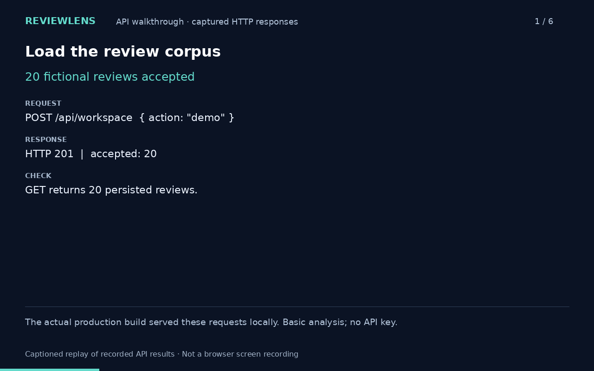
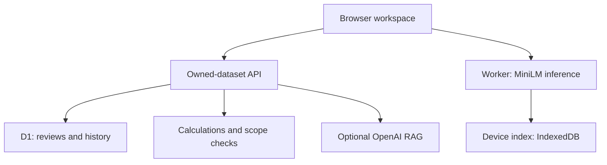

# ReviewLens

**An AI/ML delivery case study. The working product is the evidence.**

An AI/ML Technical Program Manager portfolio project by **Saahil Gupta**, built with Codex
assistance ([who did what](docs/product-case-study.md#ownership)).

ReviewLens answers questions about product reviews with verifiable statistics, traceable
source evidence, and an experimental retrieval path. The delivery problem it exists to
demonstrate is the one every AI feature has: **the demo works, and that tells you nothing
about whether the feature works.**

---

## Watch the working workflow (48 seconds)



[MP4 download](docs/demo/reviewlens-api-walkthrough.mp4) · [Captured requests and responses](docs/demo/captured-workflow.json)

This is a captioned replay of real HTTP requests to the production build, **not a browser screen recording**. It shows 20 fictional reviews, 4/20 two-star reviews, complaint ranking, exact source checks, EU scope and saved history. No API key or model inference was used. The cloud browser could not capture the local app in this session.

## Start here

| If you are here to judge                   | Read                                                                                                                                   |
| ------------------------------------------ | -------------------------------------------------------------------------------------------------------------------------------------- |
| How this was delivered, gated and measured | **[The delivery narrative](docs/delivery/narrative.md)** — the whole project on one page |
| Whether the engineering is real            | [`npm run verify`](#verify-it-yourself) — types, lint, automated tests, build, retrieval gate                                               |
| What the product does                      | [Three-minute walkthrough](#three-minute-walkthrough)                                                                                  |

## The three things worth your time

**1. A measured baseline instead of an assumption.** The hypothesis was that keyword search
misses paraphrased questions. That was a belief until it was measured. It is now a number: on
a human-labelled golden set, lexical retrieval scores **recall@5 = 0.20**. This is mean recall across five relevant-topic development questions. On _"Which customers are locked out of their accounts?"_ it
returns nothing at all. That number justifies the semantic feature and sets the bar it has to
clear.

```bash
npm run eval
```

**2. A quality gate that can fail the build.** `npm run eval` scores retrieval against the
golden set and exits non-zero below threshold. It runs in CI on every push. Two threshold
sets: a regression gate pinned at the measured baseline, and a release gate — agreed _before_
the feature was measured — that semantic retrieval must clear before shipping default-on. The
holdout split refuses to run without an explicit confirmation flag, and every holdout run is
appended to an audit log, so _"we did not tune on the evaluation set"_ is checkable rather
than promised.

**3. A no-go, now backed by measurement rather than caution.** On-device semantic search was
held back because it was unverified. It has since been run and scored: it **missed its gate on
three of four bounds**, and getting it to run at all uncovered a defect that made the feature
[unable to start in any browser](docs/delivery/postmortem-device-model-load.md). The thresholds
were not moved. See [the result](docs/delivery/evaluation-semantic-result.md).

## What is not established

Stated before the feature list, deliberately.

- **Semantic retrieval quality is now measured, and it FAILED its release gate.** The model
  ran in a real browser on 2026-09-12 and scored recall@5 = 0.267 against a bar of 0.70, with a
  one false positive across two absent-topic questions. None of the 66 tested floors cleared the quality bounds on this development set.
  See [the result](docs/delivery/evaluation-semantic-result.md).
- **Generated-answer faithfulness.** Quote _existence_ is verified in code. Claim _support_ is
  unmeasured.
- **Cross-browser IndexedDB lifecycle**, held-out retrieval accuracy, and live paid-provider
  quality.

No real-world accuracy, time-saving, adoption or revenue result is claimed. Development retrieval metrics are reported with their sample limits. [Metrics](docs/delivery/metrics.md) separates the numbers that
are measured from the targets that are merely proposed.

---

## Three explicitly different modes

| Mode                      | Mechanism                                                            | Output                                         | API cost                | Status                                 |
| ------------------------- | -------------------------------------------------------------------- | ---------------------------------------------- | ----------------------- | -------------------------------------- |
| Basic analysis            | English feature rules, deterministic calculations, lexical retrieval | Statistics and source evidence                 | None                    | Shipped                                |
| ~~On-device semantic search~~ | MiniLM embeddings and cosine similarity in a browser worker | Candidate source passages; no generated prose | No per-request charge | **FAILED evaluation.** Off by default, kept as a [measured negative result](docs/delivery/evaluation-dtype-experiment.md) |
| OpenAI RAG                | Server-side embeddings, retrieval and generation                     | Model interpretations with verified quotations | User-funded API account | Opt-in, capped at 100 req/day          |

Numerical questions and complaint rankings use deterministic analytics in **every** mode.
Retrieved examples never serve as a prevalence denominator. The on-device mode is semantic
retrieval, not generative RAG.

## Three-minute walkthrough

1. Import the fictional
   [TaskFlow reviews](examples/validation/ReviewLens_Validation_Reviews.json), or choose
   **Try the demo**.
2. Ask **What negative do most people point to?** and open a source review.
3. Ask **What percentage are two-star?** to see a calculated answer with its denominator.
4. Compare two versions, then filter to a region.
5. Inspect the source evidence behind your finding. Basic analysis requires no API key.

On-device retrieval is a failed experiment, excluded from this supported walkthrough. Its standalone harness remains available under `scripts/device-harness/`.

The hosted workspace is private — a reader cannot assume access
([ISS-05](docs/delivery/raid-log.md)). Use the local run below, or the
[demo script](docs/demo-script.md).

## Run it locally

Node.js 24, npm, Linux or Windows WSL. The build scripts require Bash and GNU `timeout`.
Internet access is needed for dependencies and model downloads.

```bash
npm ci && npm run demo
```

Open **http://127.0.0.1:8788**. The single-user local adapter persists to the ignored
`.reviewlens-local/` directory and applies bundled migrations automatically. No API key
required. This loopback adapter must never be exposed as a production server.

## Verify it yourself

```bash
npm run verify
```

Runs the typecheck, lint, automated tests, the production build, and the retrieval
quality gate. Every gate is listed in [release gates](docs/delivery/release-gates.md).

## Architecture



React/Vinext + TypeScript; Cloudflare-compatible server; D1 prepared statements. On-device
inference uses Transformers.js 3.8.1, quantized MiniLM and 384-dimension vectors in a
dedicated module worker; single-threaded WebAssembly avoids a WebGPU requirement.

The server never trusts the browser's ranking. It re-filters candidates to the owned, scoped
set and accepts only exact substrings of owned review text — the client proposes, the server
decides. OpenAI's 256-dimension vectors never enter the device index. Every control and the
test that proves it is in the [AI risk assessment](docs/delivery/ai-risk-assessment.md).

**Deployment** requires a trusted identity gateway, D1 binding `DB`, and `IDENTITY_GATEWAY`
set. Without that binding the API returns 503 rather than trusting a client-supplied identity
header — a [documented risk turned into a control](docs/delivery/decision-log.md).
`KEY_ENCRYPTION_SECRET` is needed for optional provider-key storage. Production migrations are
append-only.

## Scope and limits

- 20 datasets/user; 2,000 reviews/dataset; 2 MB/file; 6,000 characters/review. The design
  [deliberately does not scale past that](docs/delivery/decision-log.md), and says where it
  breaks.
- English feature rules can miss unfamiliar topics, sarcasm and nuance. **Unclassified does
  not mean positive.**
- Semantic similarity is not confidence. The 0.30 cutoff is an uncalibrated heuristic.
- Reviews and history remain on the server; local caches additionally hold passages and
  vectors. This is not a wholly offline app.
- Counts represent reviews, not unique people. Comparisons do not establish causation.
- No enterprise SLA, backup-restore UI or organisation billing is claimed.

## Documentation

**Delivery** — [index](docs/delivery/README.md) · [**narrative**](docs/delivery/narrative.md) ·
[**semantic result**](docs/delivery/evaluation-semantic-result.md) ·
[**load postmortem**](docs/delivery/postmortem-device-model-load.md) ·
[launch readiness](docs/delivery/launch-readiness-review.md) ·
[evaluation](docs/delivery/evaluation.md) ·
[AI risk assessment](docs/delivery/ai-risk-assessment.md) ·
[decision log](docs/delivery/decision-log.md) · [RAID log](docs/delivery/raid-log.md) ·
[program plan](docs/delivery/program-plan.md) · [metrics](docs/delivery/metrics.md) ·
[release gates](docs/delivery/release-gates.md) ·
[postmortem](docs/delivery/postmortem-rating-defect.md) ·
[on-device UAT](docs/delivery/uat-on-device.md)

**Product** — [case study](docs/product-case-study.md) · [demo script](docs/demo-script.md) ·
[release notes](docs/release-notes.md)

**Project** — [security](SECURITY.md) · [contributing](CONTRIBUTING.md) ·
[third-party notices](THIRD_PARTY_NOTICES.md) · [licence](LICENSE)
