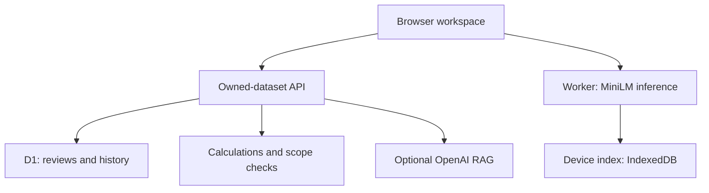

# ReviewLens

**Product-review intelligence with verifiable statistics and optional on-device semantic search.**

An AI/ML Technical Program Manager portfolio project by **Saahil Gupta**, developed with Codex assistance. ReviewLens helps product teams investigate recurring complaints, compare releases and inspect the source evidence behind an answer.

## See the product in three minutes

1. Import the fictional [TaskFlow reviews](examples/validation/ReviewLens_Validation_Reviews.json), or choose **Try the demo**.
2. Ask **What negative do most people point to?** and open a source review.
3. Ask **What percentage are two-star?** to see a calculated answer.
4. Compare two versions, then filter to a region.
5. In Settings choose **Download model & build index** under **On-device semantic search**. No API key is needed. Select the on-device mode in Ask to retrieve passages by meaning.

The hosted workspace is private; recruiters cannot assume access. Use the local demonstration below. See the [demo script](docs/demo-script.md) and [product case study](docs/product-case-study.md).

## Three explicitly different modes

| Mode | Mechanism | Output | API cost |
| --- | --- | --- | --- |
| Basic analysis | English feature rules, calculations, lexical retrieval | Statistics and source evidence | None |
| On-device semantic search | MiniLM embeddings and cosine similarity in a browser worker | Candidate source passages; no generated prose | No per-request API charges |
| OpenAI RAG | Server-side embeddings, retrieval and generation | Model interpretations with checked quotations | User-funded API account |

Numerical questions and complaint rankings use deterministic analytics in every mode. Retrieved examples never serve as a prevalence denominator. The on-device mode is semantic retrieval, not generative RAG.

## Run a local demonstration

Prerequisites: Node.js 24, npm, Linux or Windows WSL. The retained build scripts require Bash and GNU timeout. Internet access is needed for initial dependencies and model downloads.

```bash
npm ci
npm run demo
```

Open **http://127.0.0.1:8788**. The single-user local adapter persists data in the ignored `.reviewlens-local/` directory and automatically applies bundled migrations. No API key is required. Stop with Ctrl+C. This loopback adapter must never be exposed as a production server. Preserve its encryption-secret file if you save a provider key locally.

## Architecture



React/Vinext + TypeScript; Cloudflare-compatible server; D1 prepared statements. On-device inference uses Transformers.js 3.8.1, quantized MiniLM and 384-dimensional vectors in a dedicated module worker. Single-threaded WebAssembly avoids a WebGPU requirement. Public model/runtime files download from Hugging Face/jsDelivr.

Long reviews use overlapping source-preserving passages. Each completed review is checkpointed locally; pause terminates computation and resume reuses completed records. Cache fingerprints include model/processing version and review text. OpenAI's 256-dimensional vectors never enter the device index. The API rechecks selected passages against owned, scoped source text before saving an answer.

## Verification

```bash
npx tsc --noEmit
npm test
```

Tests cover import validation, ownership, calculations, scope, citations, simulated provider integration, local vector ranking and provider-error messages. The current suite contains 51 automated checks; the in-app Quality tab separately contains 24 synthetic acceptance questions. A GitHub Actions workflow runs type checking, lint and the complete test/build path.

The owner reported accurate behavior for the supplied clean and error fixtures in the original browser release. This is a user report, not independent model-quality evidence. [Expected answers](examples/validation/ReviewLens_Validation_Guide.md) remain outside the app's evidence.

**Not yet established:** actual on-device model loading/inference in a user browser, cross-browser IndexedDB lifecycle, held-out retrieval accuracy and live paid-provider quality. The authoring environment could not download the external model/runtime for a real-inference test. Synthetic-vector tests do not establish embedding quality. See [evaluation](docs/evaluation.md).

## Scope and limits

- 20 datasets/user; 2,000 reviews/dataset; 2 MB/file; 6,000 characters/review.
- English feature rules can miss unfamiliar topics, sarcasm and nuance. Unclassified does not mean positive.
- Semantic similarity is not confidence. The initial 0.30 cutoff is a heuristic requiring calibration. Results are marked limited evidence.
- Reviews and history remain on the server. Local caches additionally contain review passages/vectors. This is not a wholly offline app.
- Initial download needs internet and device resources. Cache eviction requires rebuilding; failed downloads offer a Basic analysis fallback.
- OpenAI is capped at 100 attempts/user/UTC day, including failures. ChatGPT Plus does not fund API usage.
- Counts represent reviews, not unique people; comparisons do not establish causation.
- No enterprise SLA, backup-restore UI or organisation billing is claimed.

## Product and delivery documentation

- [QA defect and regression case study](docs/qa-rating-fix.md)
- [Adversarial QA remediation and verification](docs/qa-remediation.md)
- [Publish this repository on GitHub](docs/github-publishing.md)
- [Product case study](docs/product-case-study.md)
- [Architecture decisions](docs/architecture-decisions.md)
- [Evaluation and UAT](docs/evaluation.md)
- [Backlog and risk register](docs/roadmap-and-risks.md)
- [Demo script](docs/demo-script.md)
- [Security](SECURITY.md)
- [Third-party notices and attribution](THIRD_PARTY_NOTICES.md)

Hosted deployment requires a trusted identity gateway, D1 binding `DB` and runtime `KEY_ENCRYPTION_SECRET` for optional key storage. Production migrations are append-only. The portfolio export omits owner-specific deployment identity, private archives and runtime data while retaining logical hosting configuration.
